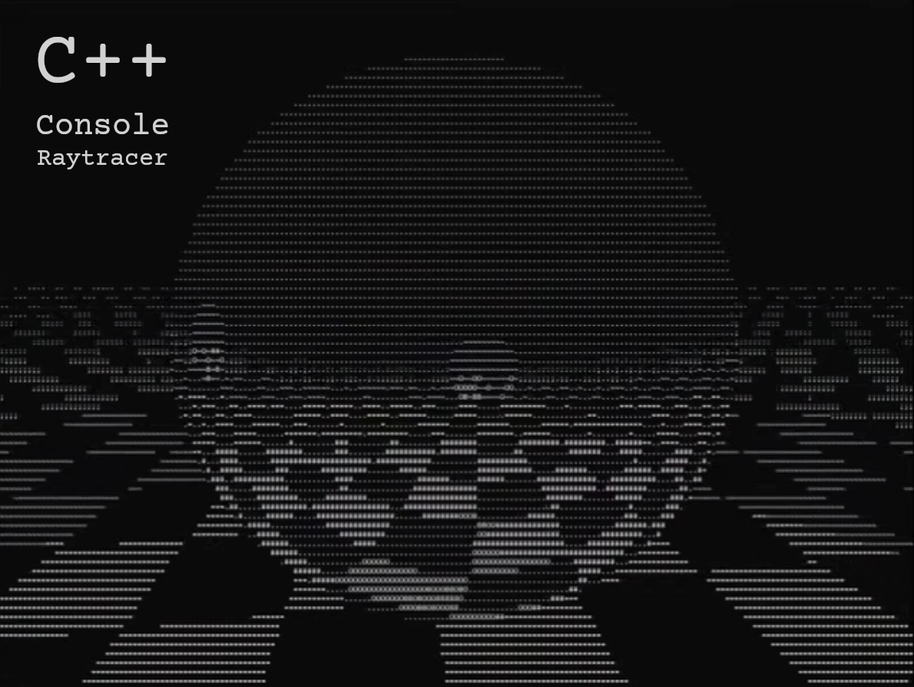
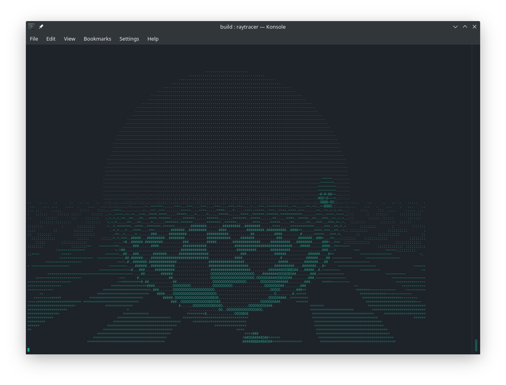

## Demo Video
[](https://www.youtube.com/watch?v=QkETiyYWh2o)

## Welcome

Welcome to Ray. A C++ program that can do Raytracing in the console. This is pure bit-beauty.

## Build

Using CMake: 
```CMake
git clone https://github.com/DinoZ1729/Ray.git
cmake -S Ray -B build
cmake --build build
```

Manual:
```shell
$CXX -std=c++17 src/*.cpp -o raytracer
```

## License

This program is licensed under the GNU GPL v3 License. Please read the License file to know about the usage terms and conditions.
