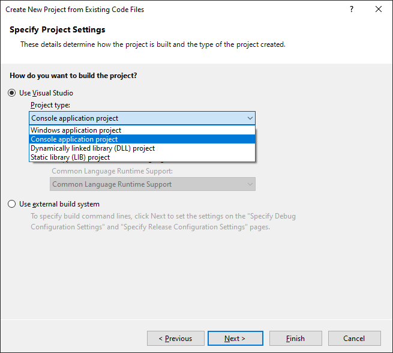

## Welcome

Welcome to Ray. A C++ program that can do Raytracing in the console. This is pure bit-beauty.

## License

This program is licensed under the GNU GPL v3 License. Please read the License file to know about the usage terms and conditions.

## **How To: Compile and Run**

### **Windows compile**

You can use Visual Studio 2019 to run this code with the following way:

* Open up Visual Studio and continue with the option **"Continue without code ->"**

* Select **"File->New->Project From Existing Code..."**

* Leave the default type of project, click **"Next >"** and specify the location of the downloaded project (for example: **"C:\Ray"**)

* Click **"Next >"** and specify that the project type should be a: **"Console application project"**. Then click **"Finish"**

* Run the project by clicking **"Local Windows Debugger"**

### **Linux/MinGW compile**

In order to compile and run on a Linux/GNU distro, you will need to run the following commands in the location of the project:

* $ **g++ \*.cpp -lm**
* $ **./a.out**

